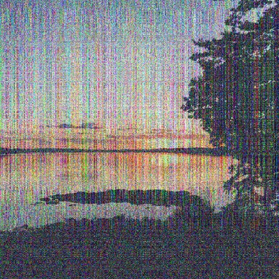

# PSN: Partitioning Signal and Noise

**PSN** denoises multi-trial neural data by estimating signal and noise covariances
([GSN](https://github.com/cvnlab/GSN)), projecting into an optimal basis, and selecting
how many dimensions to retain.

> **Note:** PSN is under active development. The API and functionality are subject to change.

| Clean (ground truth) | Single noisy trial | PSN denoised |
|:---:|:---:|:---:|
|  |  |  |

---

## Installation

### Python

```bash
git clone https://github.com/jacob-prince/PSN.git
cd PSN
pip install -e .
```

### MATLAB

```bash
git clone --recurse-submodules https://github.com/jacob-prince/PSN.git
```

If you've already cloned without submodules:
```bash
cd PSN && git submodule update --init --recursive
```

---

## Data Format

Both Python and MATLAB expect `(n_units, n_conditions, n_trials)` with `n_trials >= 2`.

**NaN handling**: PSN supports uneven trials across conditions. Missing trials can be
indicated with NaNs. Each condition must have at least one trial with valid data across
all units.

---

## Quick Start

### Python

```python
from psn import psn, generate_data

# Synthetic data: (n_units, n_conditions, n_trials)
train_data, _, _ = generate_data(nvox=50, ncond=200, ntrial=5, random_seed=42)

results = psn(train_data)                  # 'standard' (default)
results = psn(train_data, 'conservative')  # 99% signal-variance retention
results = psn(train_data, 'aggressive')    # difference basis, prediction peak
results = psn(train_data, 'compare')       # best of signal vs difference basis
results = psn(train_data, 'wiener')        # full-rank matrix Wiener filter

denoised = results['denoiseddata']         # (n_units, n_conditions)
```

### MATLAB

```matlab
cd('path/to/PSN/matlab')
data = randn(50, 100, 5);                 % [n_units x n_conditions x n_trials]

results = psn(data);                       % 'standard' (default)
results = psn(data, 'conservative');
results = psn(data, 'aggressive');
results = psn(data, 'compare');
results = psn(data, 'wiener');
```

> The MATLAB and Python implementations are feature-for-feature equivalent for the
> denoising algorithm. Python-only conveniences: GPU acceleration (`device`), the
> scikit-learn `PSN` estimator, and the keyword / `opt=` argument forms.
> See [matlab/README.md](matlab/README.md) for detailed MATLAB documentation.

---

## Image Denoising Example

`generate_data` can simulate noisy multi-trial measurements from an image.
PSN denoises the trial-averaged data, recovering the clean image:

```python
import numpy as np
from PIL import Image
from psn import psn, generate_data

# Load an image and simulate noisy multi-trial measurements
img = np.array(Image.open('examples/sunset.jpg').resize((1000, 1000))) / 255.0
H, W, C = img.shape
train_data, _, gt = generate_data(
    true_signal=img, ntrial=3, noise_multiplier=100.0, random_seed=42
)
# train_data shape: (1000, 3000, 3) -> (n_units, n_conditions, n_trials)

# Denoise with PSN
results = psn(train_data, 'wiener')

# Reconstruct images
clean    = np.clip(gt['signal'].T.reshape(H, W, C), 0, 1)
noisy    = np.clip(train_data[:, :, 0].reshape(H, W, C), 0, 1)
denoised = np.clip(results['denoiseddata'].reshape(H, W, C), 0, 1)
```

---

## Configuration

Options can be passed as a dict, via `opt=`, or as keyword arguments. A named
mode can be combined with any of these:

```python
psn(train_data, {'basis': 'signal', 'device': 'cuda'})   # positional dict
psn(train_data, opt={'basis': 'signal'})                  # opt= keyword
psn(train_data, basis='signal', device='cuda')            # keywords
psn(train_data, 'aggressive', device='cuda')              # mode + keyword override
```

In MATLAB, pass an options struct: `psn(data, opt)`.

| Parameter | Options | Description |
|-----------|---------|-------------|
| **basis** | `'signal'` (default), `'difference'`, `'pca'`, `'noise'`, `'random'`, `'compare'`, custom matrix | Basis for dimensionality reduction |
| **criterion** | `'max-tradeoff'` (default), `'prediction'`, `'variance'`, `'variance_eigenvalues'`, `'wiener'` | How to select the dimensionality threshold |
| **threshold_method** | `'global'` (default), `'hybrid'` | Single population threshold, or per-unit thresholds on a shared ordering |
| **alpha** | `0.0`–`1.0` (or `None`) | Interpolates between the prediction peak (0) and the trial average / do-nothing point (1). Overrides `criterion`. |
| **variance_threshold** | `0.0`–`1.0` (default `0.99`) | Target signal-variance fraction for `criterion='variance'`/`'variance_eigenvalues'` |
| **allowable_thresholds** | vector (or `None`) | Restrict the threshold to these values; a single value forces that many dims |
| **basis_ordering** | `'eigenvalues'` (default), `'signalvariance'` | Initial global order of basis vectors |
| **unit_groups** | `[n_units]` integer labels | Units sharing a label share a threshold (`'hybrid'` only) |
| **gsn_result** | dict / struct | Reuse precomputed GSN covariances to skip estimation |
| **device** *(Python only)* | `'cpu'` (default), `'cuda'`, `'mps'` | Run on GPU via torch (only when explicitly set) |

---

## Advanced Usage

#### Caching GSN Across Hyperparameter Sweeps

GSN covariance estimation is the expensive step. Pass the cached result back in to
avoid re-running it:

```python
results = psn(train_data)
for alpha in [0.0, 0.25, 0.5, 0.75, 1.0]:
    out = psn(train_data, alpha=alpha, gsn_result=results['gsn_result'])
```

#### Applying the Denoiser to Held-Out Data

```python
results = psn(train_data)
denoiser = results['denoiser']
unit_means = results['unit_means'][:, None]

test_avg = np.nanmean(test_data, axis=2)
denoised_test = denoiser.T @ (test_avg - unit_means) + unit_means
```

#### GPU Acceleration (Python only)

Set `device='cuda'` or `device='mps'` to run the heavy linear algebra on GPU via torch.
Pass data as a numpy array — PSN handles the transfer. GPU pays off mainly at large
`n_units` (~10k+).

```python
results = psn(train_data, device='cuda')
```

#### scikit-learn Estimator (Python only)

```python
from psn import PSN
model = PSN()
denoised = model.fit_transform(train_data)
```

See [SKLEARN_API.md](SKLEARN_API.md) for the full estimator API.

---

## Output Structure

`psn` returns a dictionary (Python) or struct (MATLAB):

```python
results['denoiseddata']      # (n_units, n_conditions) - denoised estimates
results['residuals']         # (n_units, n_conditions, n_trials) - data minus denoised
results['denoiser']          # (n_units, n_units) - denoising matrix
results['unit_means']        # (n_units,) - per-unit means used for centering
results['best_threshold']    # dims retained (scalar, or per-unit array for 'hybrid')
results['fullbasis']         # (n_units, n_dims) - basis vectors
results['signalvar']         # signal variance per dimension
results['noisevar']          # noise variance per dimension
results['objective']         # cumulative objective curve
results['svnv_before']       # (n_units, 2) - signal/noise variance before denoising
results['svnv_after']        # (n_units, 2) - signal/noise variance after denoising
results['gsn_result']        # GSN output (cSb, cNb, ...) for caching
results['recovery_tradeoff'] # diagnostic data behind the recovery figure
```

---

## Citation

```
[Citation information will be added upon publication]
```

## License

MIT. See [LICENSE](LICENSE).

## Contributing

Feedback, bug reports, and contributions are welcome — please open an issue or pull request on GitHub.
